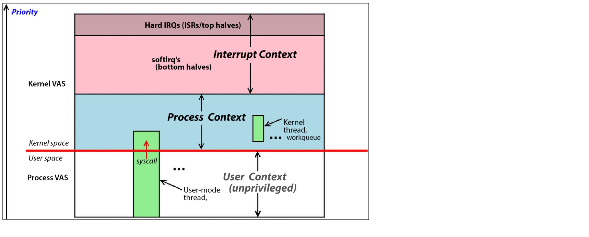
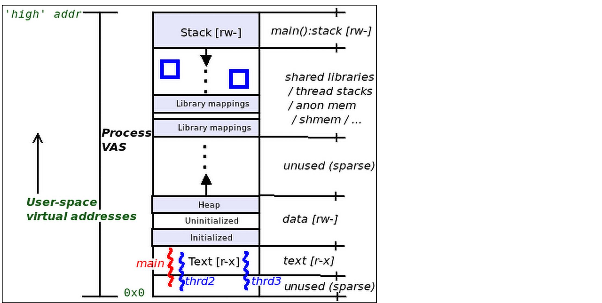
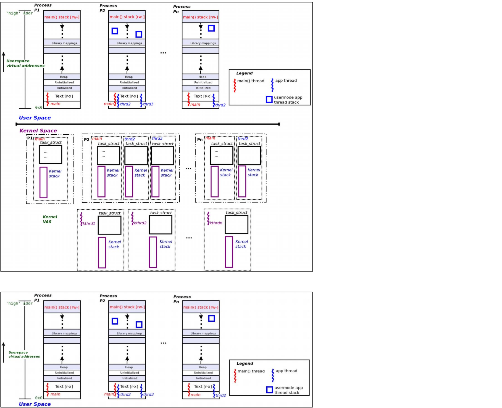
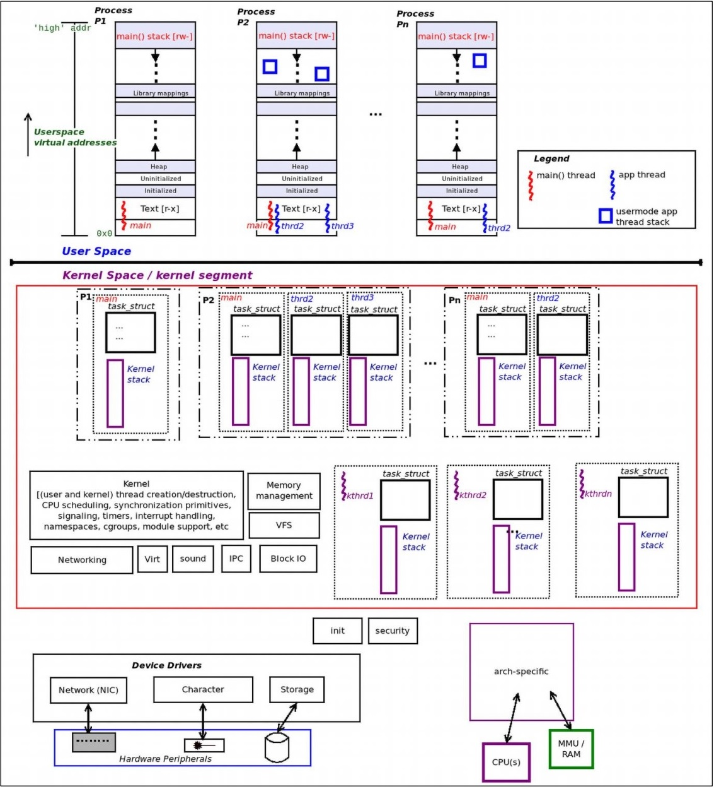
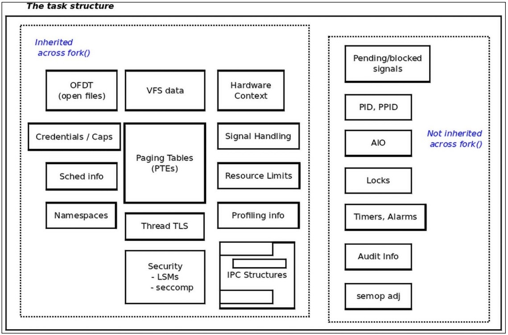
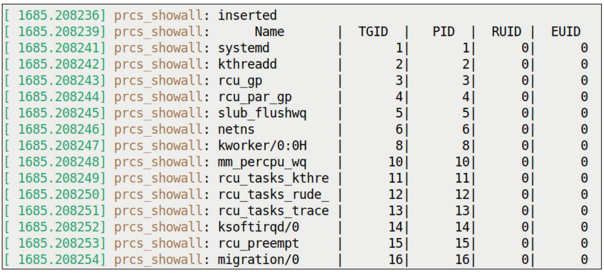
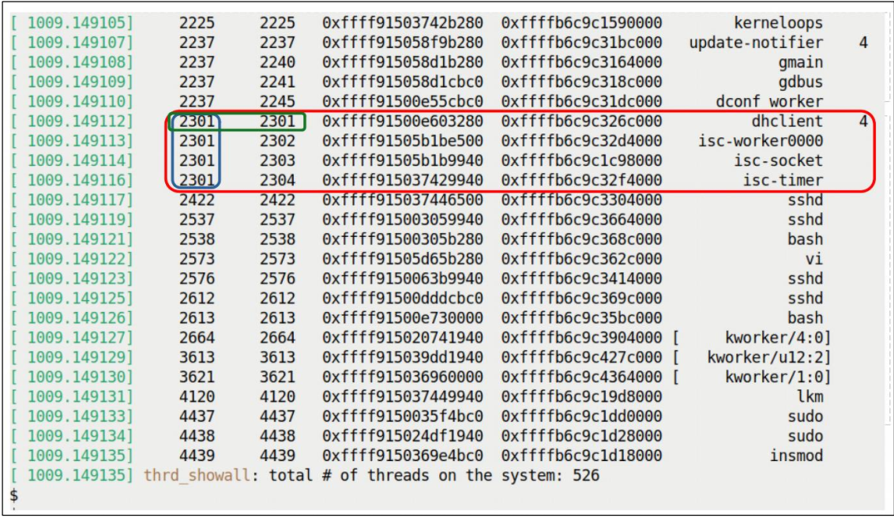

#

- Modern processors execute code at different levels of privileges.
- x86 offers four levels (or rings) ring 0 > ring 1 > ring 2 > ring 3
- arm-32 offeres seven execution modes, six of which are priviliged.
- arm-64 uses the notion of Exception levels (EL0 to EL3) where EL3 > EL2 > EL1 > EL1
- Modern OSs have two available CPI privleges levels - user and kenel.
- Modern OS are monolithic (a large piece of stone -_-) when a process or thread issues the system call, it is switched to kenel mode and itself executes kenel mode.
- The kernel code executes within the context of user-space process or thread - we call it process context.
- Besides process context, another way kernel code executes - Hardare Interrupts (keyboard, network card, disk and usb and other stuff)
- CPU saves the current context and immediately re-vectors the CPU to run the code of the Interrupt Handler (Interrupt Service Routine, ISR)
- This runs in privliged mode and is asynchronous way to switch to kernel mode. (Interrupt context)

### Context

- Process context - kernel pocess is entered becz a pocess or thread issued a system call or a processor exception (page faults like that), kernel code is executed, kernel data is woked upon and is typically synchronous.
- Interrupt context - Kernel space is entered becz a peripheral chip asserrted a hardware interrupt, kernel code is executed, kernel data is worked upon and it's asynchronous.

## Understanding the VAS (Virtual Addrress Space)

- A fundamental rule of virtual memory is that all potentially addressable memory is in a box: that is it's sandboxed.
- We see the box as process image or process VAS.
- The user VAS is divided into homogenous memory called segments (o mappings), Internally they are contructed via mmap() system call.
- Text segment: Where machine code is stoed, where the processor core's instruction pointer register points while a thread of proocess executes code, static/fixed size. (Text segment doesn't stat at virtual address 0x0, it;s above that, the very first virtual page - the one encapsulating the NULL address 0x0 - called null-trap page).
- Data segment: Above text segment, it stores global and static data variables into 3 data segments:
1. Initialized: global/static vaiables ae stored here.
2. Uninitialized: they are auto-initialized to 0 at runtime - it's bss also.
3. Heap: Standard C lib APIs for memory allocation and freeing get memory from here. malloc() as we have.
On modern glibc, only malloc() calls fo memoy below MMAP_THESHOLD bytes (128 kb by default) get memoy from the heap.
Any higher than that is allocated as a seperate mapping in process VAS by mmap() system call (also called anonymous (or anon) mapping).
Heap grows up towards higherr VA and last legally reference able location one the heap is referred to as the program break (sbrk(0)).

- Shared libs (text, data): All shared libs that a process dynamically links to are mapped at runtime by mmap() into process VAS somewhere between top of heap and below stack of the main() thread.
- Stack: A region of memory which uses LIFO semantics.
- It's used to implement a high-level language's function calling mechanism and holds the thead context.
- It's a dynamic segment and grows down in VAS.
- Everytime a funtion is called, a stack frame is allocated and is very CPU-dependent (also called CPUT Application Binary Interface, ABI)
- The processor's core Stack pointer refister alays points to current frame, top of stack. As it grows down, top of stack is usually lower address.
- Processes must contain atleast one thread in execution (a thread is just an execution path with in a process).
- Like one is main() function, Every thread shares everything within the process VAS except for the stack.
- Every thread has it's own private stack.
- The stacks of other threads can be allocated anywhere between lib mappings and main() is at the top of stack.
- Try procmap() utility for VAS visual.



### Process, threads and their stacks

- Threads share everything, all process resources, user VAS, open files, signal dispositions, IPC objects, pagining tables and more except the stack.
- Every thread has it's own private stack as it's the stack that holds the execution context, if not, how they could run in parallel.
- For now, Thread (not the process) is the kenel scheduleable entity (KSE) - it's what gets scheduled to un on a CPU core.
- On linux, evey thread inclunding kenel threads maps to kernel metadata structure called task structure (also called process descriptor).
- For every thead alive, kernel maintains a corresponding task structure.

### We require one stack per thread per privilege level supported by the CPU

- User sapce stack in in play when thread executes user-mode code paths.
- Kernel space stack is in play when the thread switches to kernel mode via a system call or processor exception and executes kernel code paths (in process context)
- Kernel thread are pure, can't see the userland.

#### User space Organization

- Every process has at least once thread of execution main() thread.
- Threads could be within that process other than main thread
1. One user space stack is always present for the main thread. If it's single threaded (only main), it will have just one user mode stack.
2. If a process is multi-threaded, it will have one user mode thread stack per thread alive (including main()). The stacks are allocated either at the time of calling fork (for main() or pthread_create()) for the remaining threads within the process which results in this code path being executed in process context within the kernel itself.
3. User stack space is dynamic, grow and shrink and size limit is RLIMIT_STACK (~ 8MB), we can look with prlimit.

#### Kernel space Orgranization
1. There will be one kernel mode stack for each user mode thread alive including main.
2. Kernel mode stacks are fixed in size (static) and are small (2 pages in 32 bit, 4 pages in 64 bit ~ 4kb in size) getpagesize() system call check.
3. Each kernel thread has a task structure and a kernel mode stack is allocated to it at creation time and kernel thread has link to user space, it can't see.
4. Don't overflow your kenel stack, it's fixed and quite small.
5. Every thread alive has a task structure in kenel, that's how it tracks it and all threads attributes are stored here.
- and also a seperate stack IRQ is present to read hardware interrupts.



## Viewing the User and Kernel stacks

- It's helpful in debug as the stack only holds the current execution context of the thread in hich funtion it is executing code right now, how it got here - which allows us to inder the history.
- Being able to see and interpret the thread's call stack (call chain/call trace/ backtrace) is crucial.



#### We can see throguh proc filesystem (kernel space stack of a given thread or process)

- in /proc/PID/stack (pseudofile)
```
wiki@pi:~/Linux-Kernel-Programming_2E/ch6$ sudo cat /proc/210/stack
[<0>] rescuer_thread+0x31c/0x420
[<0>] kthread+0xf4/0x108
[<0>] ret_from_fork+0x10/0x20
```

- The function call graph ordering is from bottom up.
- Each line of output is a call frame, a function in call chain.
- if a call frame is ?, kernel can't interrpret this stack frame.
- Any linux foo() system call will typically become a sys_foo() funciton within the kenel.
- [<0>] zeroed oyt each stack frame for security reasons.
- <func>+x/y ? ---> x is byte offset from beginnning of the function where the execution is currently at and y is what the kerrnel has deemed to be the length of this function.

#### Viewing the user space stack of a given thread/process

- it's not easy as in kernel space.
- We use GDB debugger
- using ustack example from book, this is the output
```
wiki@pi:~/Linux-Kernel-Programming_2E/ch6$ ./ustack $(pgrep --newest bash)

warning: could not find '.gnu_debugaltlink' file for /lib/aarch64-linux-gnu/libtinfo.so.6
[Thread debugging using libthread_db enabled]
Using host libthread_db library "/lib/aarch64-linux-gnu/libthread_db.so.1".
0x0000ffff8ff17a6c in __GI___wait4 (pid=-1, stat_loc=0xffffc72e0740, options=10, usage=0x0) at ../sysdeps/unix/sysv/linux/wait4.c:30

warning: 30     ../sysdeps/unix/sysv/linux/wait4.c: No such file or directory

Thread 1 (Thread 0xffff9007d020 (LWP 1450) "bash"):
#0  0x0000ffff8ff17a6c in __GI___wait4 (pid=-1, stat_loc=0xffffc72e0740, options=10, usage=0x0) at ../sysdeps/unix/sysv/linux/wait4.c:30
#1  0x0000aaaabb26f984 in ?? ()
#2  0x0000aaaabb1bcf6c in wait_for ()
#3  0x0000aaaabb19f6a8 in execute_command_internal ()
#4  0x0000aaaabb19fa84 in execute_command ()
#5  0x0000aaaabb190800 in reader_loop ()
#6  0x0000aaaabb185490 in main ()
[Inferior 1 (process 1450) detached]
```

- Read bottom-up.

### Modern ways to view both stacks (eBPF)

- Extended Berkeley Packet Filter
- Install: sudo apt-get install bpfcc-tools linux-headers-$(uname -r)
- Checkout: https://github.com/iovisor/bcc/blob/master/tools/stackcount_example.txt
```
wiki@pi:~/Linux-Kernel-Programming_2E/ch6$ stackcount-bpfcc -v
usage: stackcount-bpfcc [-h] [-p PID] [-c CPU] [-i INTERVAL] [-D DURATION] [-T] [-r] [-s] [-P] [-K] [-U] [-v] [-d] [-f] [--debug] pattern
stackcount-bpfcc: error: the following arguments are required: pattern
wiki@pi:~/Linux-Kernel-Programming_2E/ch6$ stackcount-bpfcc -h
usage: stackcount-bpfcc [-h] [-p PID] [-c CPU] [-i INTERVAL] [-D DURATION] [-T] [-r] [-s] [-P] [-K] [-U] [-v] [-d] [-f] [--debug] pattern

Count events and their stack traces

positional arguments:
  pattern               search expression for events

options:
  -h, --help            show this help message and exit
  -p PID, --pid PID     trace this PID only
  -c CPU, --cpu CPU     trace this CPU only
  -i INTERVAL, --interval INTERVAL
                        summary interval, seconds
  -D DURATION, --duration DURATION
                        total duration of trace, seconds
  -T, --timestamp       include timestamp on output
  -r, --regexp          use regular expressions. Default is "*" wildcards only.
  -s, --offset          show address offsets
  -P, --perpid          display stacks separately for each process
  -K, --kernel-stacks-only
                        kernel stack only
  -U, --user-stacks-only
                        user stack only
  -v, --verbose         show raw addresses
  -d, --delimited       insert delimiter between kernel/user stacks
  -f, --folded          output folded format
  --debug               print BPF program before starting (for debugging purposes)

examples:
    ./stackcount submit_bio         # count kernel stack traces for submit_bio
    ./stackcount -d ip_output       # include a user/kernel stack delimiter
    ./stackcount -s ip_output       # show symbol offsets
    ./stackcount -sv ip_output      # show offsets and raw addresses (verbose)
    ./stackcount 'tcp_send*'        # count stacks for funcs matching tcp_send*
    ./stackcount -r '^tcp_send.*'   # same as above, using regular expressions
    ./stackcount -Ti 5 ip_output    # output every 5 seconds, with timestamps
    ./stackcount -p 185 ip_output   # count ip_output stacks for PID 185 only
    ./stackcount -c 1 put_prev_entity   # count put_prev_entity stacks for CPU 1 only
    ./stackcount -p 185 c:malloc    # count stacks for malloc in PID 185
    ./stackcount t:sched:sched_fork # count stacks for sched_fork tracepoint
    ./stackcount -p 185 u:node:*    # count stacks for all USDT probes in node
    ./stackcount -K t:sched:sched_switch   # kernel stacks only
    ./stackcount -U t:sched:sched_switch   # user stacks only
```

- Other profiling tools, perf, flame graphs, bpftrace, strace



## More view of VAS
- There is lot more going on in kenel: per thread task structures, kernel threads, perr-process memory descriptor metadata structures, open file metadata structures, IPC metadata structures, and so on. Kerel VAs or segment.
- Kernnel: user and kernel thread creation/destruction, CPU scheduling, synchronization primitives, singalling, timerrs, interrupt headling, namespaces, cgroups, module support etc.
- MMU, VFS, Networking, Virt, Sound, IPC, Block IO, arch-speicifc cpurs and mmu/ram stuff

- Every single user and kernel space thread is interally represented within the linux kernel by a metadata containing all attributes - task structure.
- include/linux/sched.h: struct task_struct (also known as process descriptor) it represents a runnable task, a thread.
- Every process consists of one or more threads adn each thread maps to a kernel metadata struct called a task structure(struct task_struct).
- It's the "root" metadata fir tge thread as it has all the information required by the OS for that thread.
- Info.: info on its memory (segments/mappings setup, paging tables, usage info and more), CPU scheduling details, all files it currently has open, it's credentials, capability bitmasks, timers, locks, Asynchronous I/O (AIO) contexts, hardware context ingo, signal dispositions, IPC objects, resource limits, audit (optional), security and profiling info and many more.



### Looking into kernel Task struct and how to access

- Task struct is essentially the root data structure of the process or thread. It holds all the attributes of the task.

```
// include/linux/sched.h
stuct task_struct {
    struct thread_info thread_info; // important flags and status bits
    ...
    // members that fllow are to do with CPU sched
    int on_rq;
    int prio;
    int static prio;
    unsigned int rt_priority
    struct sched_entity se;
    ...
    // some memory management info.
    struct mm_struct *mm;
    struct mm_struct *active_mm;
    // task pid (process id) and tgid (thread group id)
    pid_t pid;
    pid_t tgid;
    // credentials
    //signal handlers
    ...
    // pointer to files

    // task hardware context detail
}
```

#### How to access the task struct with current
- All the task struct objects in kernel memory are chained up on a CIRUCULAR DOUBLY LINKED LIST called the task list.
- So, how exactly does it find it's task from the task_list ?
- It checks up on macro called current.
1. Looking up currsent yields the pointer to struct task_struct of the thread that is running the kernel code right now.
2. current is analogus to this (like in oops but not exactly)
3. Implementation of current is arch specific. O(1) time.
Like in RISC (Reduced Instruction Set Computer) arch, there is current register available.
4. To access we can use, current->pid, current->comm like that.

### Determining the Context
- Process context (or task)
- Interrupt context (or an atomic)

- They are mututally exclusive.
- Why is it important to determine the context ?
- The kernel is that you can not sleep (or block) in any kind of atomic context; doing so causes a kernel bug. it can lck up the system, typically causing a kernel panic.
- why ? Sleeping implies context-switching, switching the CPU to run another task hile the previous one goes to sleep.
- Sleeping implies invoking the scheduler code and a subsequent context switch.
- Atomic imples running to complletion without interruption.

How do we know it's in atomic context or not ?
- include/linux/preempt.h
- in_task() macro returns a boolean, your code is running in process or task context if true and usually safe to sleep and false is in atomic context, never safe to sleep.
```
wiki@pi:~/Linux-Kernel-Programming_2E/ch6/current_affairs$ sudo insmod ./current_affairs.ko 
wiki@pi:~/Linux-Kernel-Programming_2E/ch6/current_affairs$ lsmod | grep current_affairs.
current_affairs        12288  0
wiki@pi:~/Linux-Kernel-Programming_2E/ch6/current_affairs$ sleep 1
wiki@pi:~/Linux-Kernel-Programming_2E/ch6/current_affairs$ sudo rmmod current_affairs 
wiki@pi:~/Linux-Kernel-Programming_2E/ch6/current_affairs$ sudo dmesg
[ 8224.775995] current_affairs: loading out-of-tree module taints kernel.
[ 8224.776468] current_affairs:current_affairs_init(): inserted
[ 8224.776476] current_affairs:current_affairs_init(): sizeof(struct task_struct)=8704
[ 8224.776485] current_affairs:show_ctx(): 
[ 8224.776489] current_affairs:show_ctx(): we're running in process context ::
                name        : insmod
                PID         :   5797
                TGID        :   5797
                UID         :      0
                EUID        :      0 (have root)
                state       : R
                current (ptr to our process context's task_struct) :
                              0xffff21f700888000 (0xffff21f700888000)
                stack start : 0xffff800082128000 (0xffff800082128000)
[ 8248.738490] current_affairs:show_ctx(): 
[ 8248.738510] current_affairs:show_ctx(): we're running in process context ::
                name        : rmmod
                PID         :   5882
                TGID        :   5882
                UID         :      0
                EUID        :      0 (have root)
                state       : R
                current (ptr to our process context's task_struct) :
                              0xffff21f7070f0000 (0xffff21f7070f0000)
                stack start : 0xffff800081650000 (0xffff800081650000)
[ 8248.738527] current_affairs:current_affairs_exit(): removed
```

### Iterating Task List

- Linux kernel uses a unique task structure to represent every thead, and as unique process identifier(pid).
- So every thread has a unique PID. Then what about multi-threaded process, how can then multiple threads of the same process share a common PID (POSIX standards).
- Every thread of a multi-threaded process has a unique PID. To fix as per standards
- A new membe called Thread Group Identifier(TGID) was added in task structure.
- If it's single threaded - TGID = PID
- If it's multi-threaded TGID of main thread = PID of main thread and other threads of the process will inherit the main thread's TGID value but will have their own unique PID as well.
- If TGID repeats, it's multi-threaded and PID value represents the unique PIDs of its worker and peer threads.
- Try: ps -LA
- PID and LWP will show up. LWP (Light weight process or thread)



