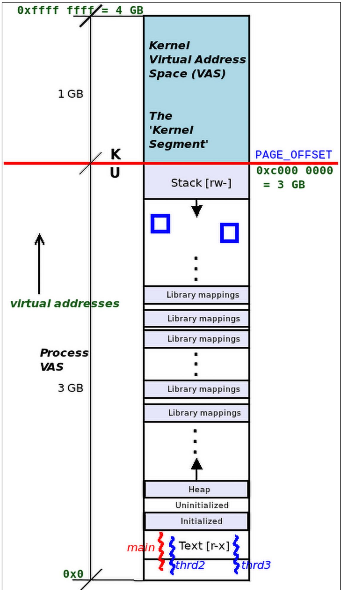
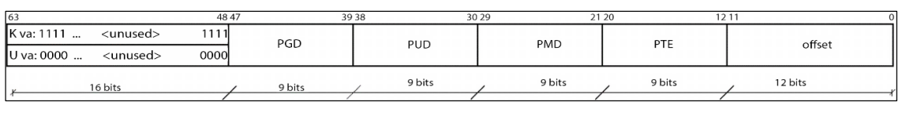
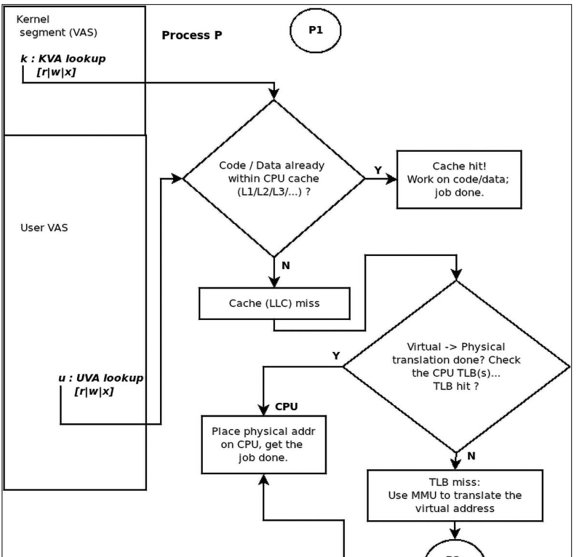
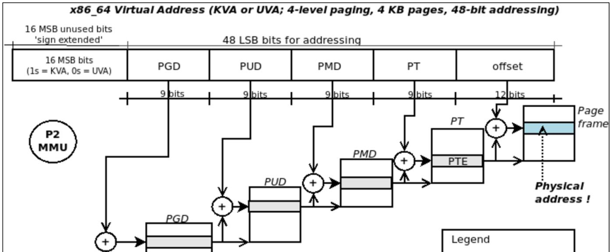
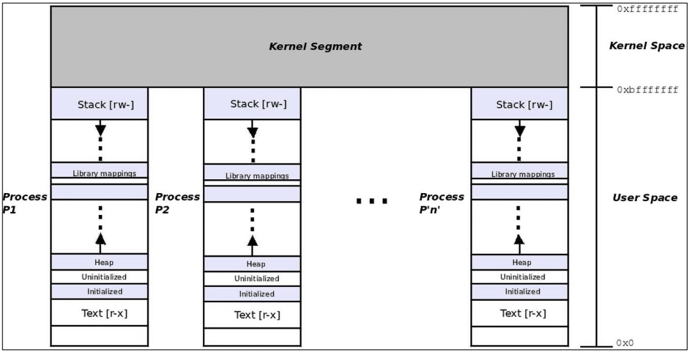
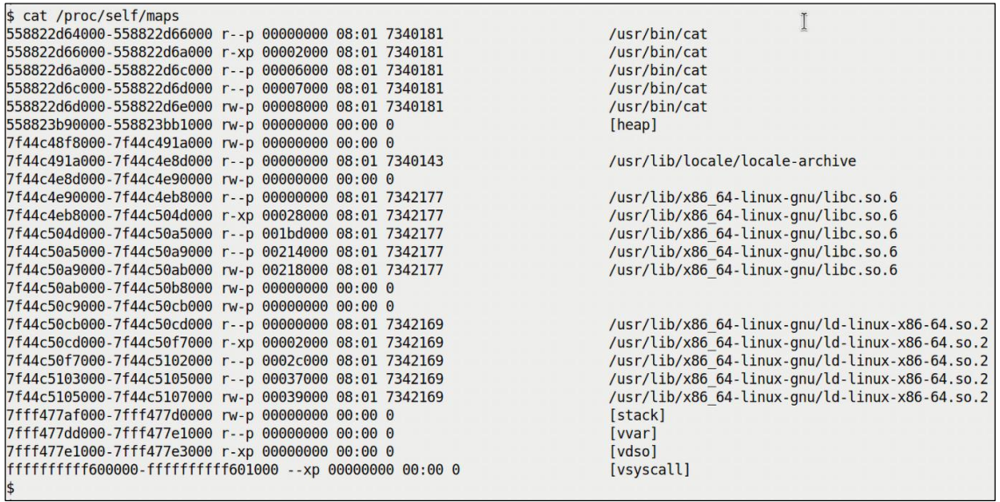
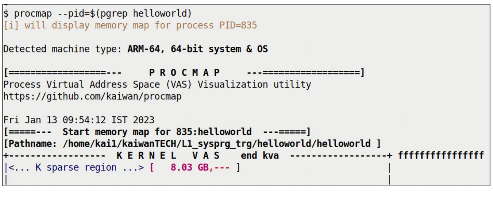
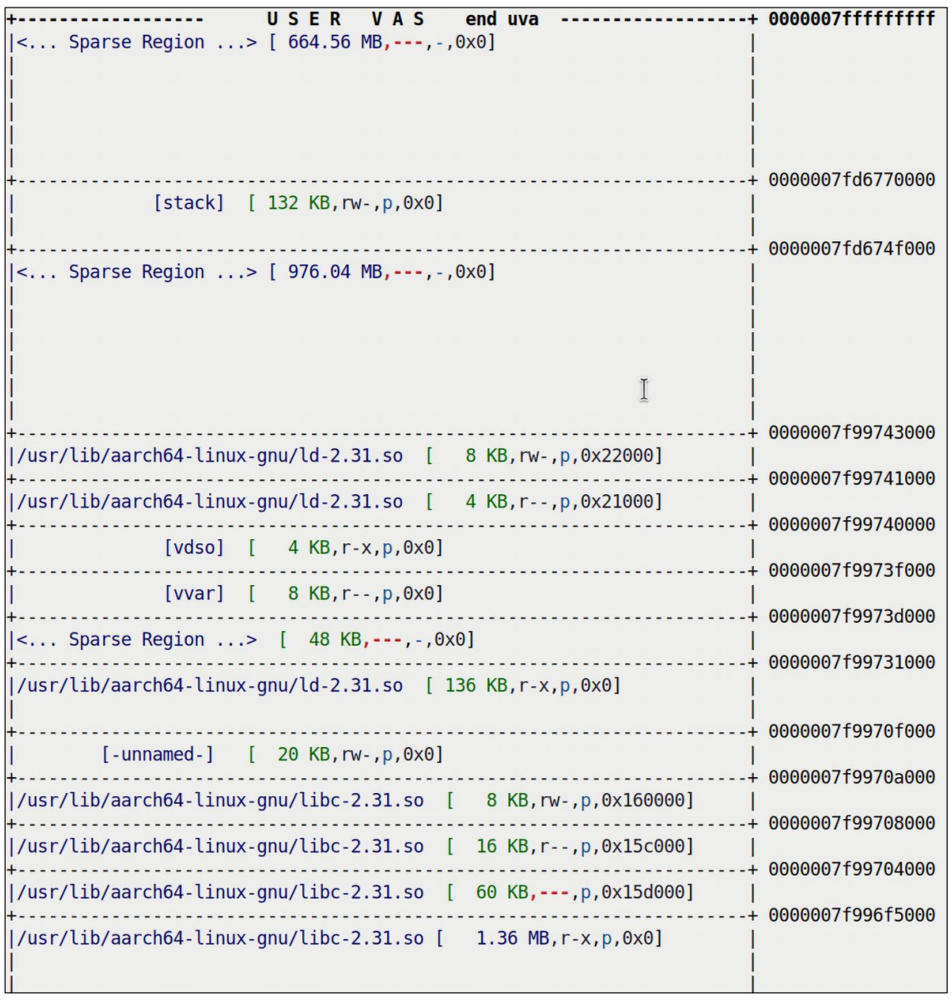
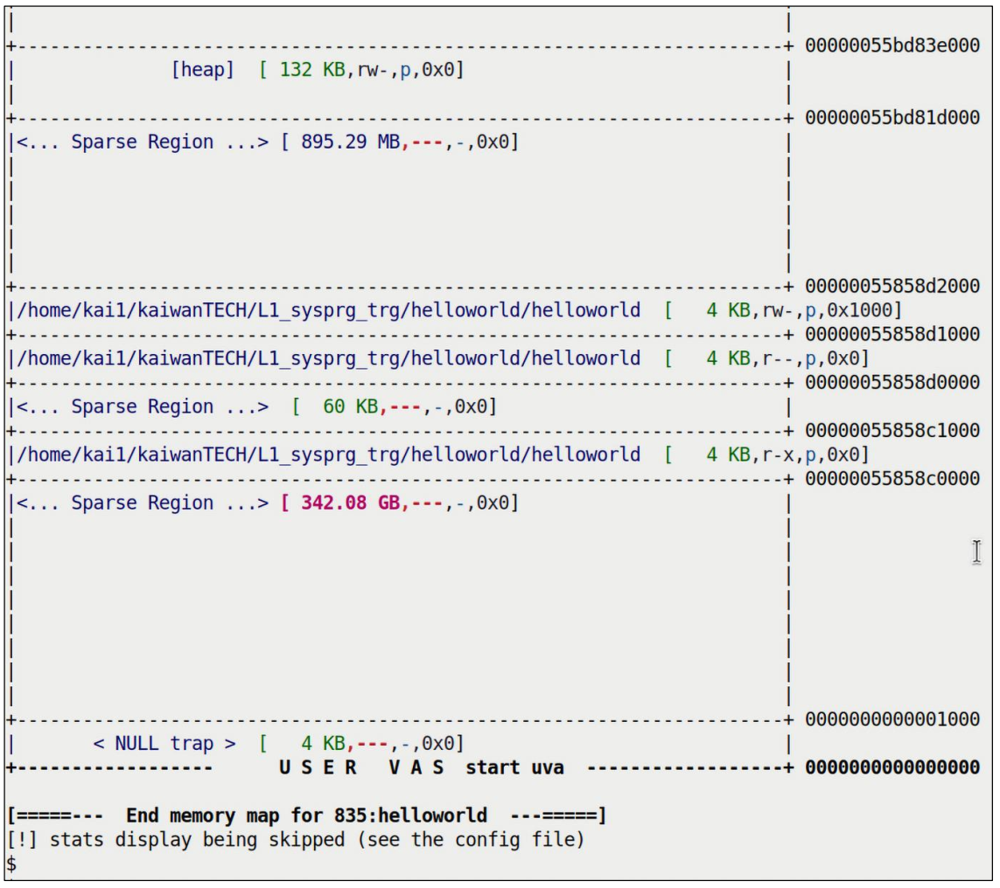

# VM Split

## printf() API
printf("hello world!\n");
The process is calling the printf() function.
The code and data for printf must be mapped to within the process box - process VAS.
How did this mapping happen ?
On application startup, as part of C runtime env setup, there is a small Executable and Linkable Format binary (ELF) embedded into a.out called the loader (ld.so or ld-linux.so), it's given early control access.
It detects all the shared libraries and memory maps all of them into the process VAS and issue mmap() system call.
- Try strace on hello.

- printf() invokes write() system call, this implies that the current process (or thread) in process context must now switch t kernel mode and run kernel code of write(). But kernel code of write is in kernel VAS. If kernel VAs is outside the box, how do we call it then ?
- It could be done by placing user and kernel space into two seperate 4gb spaces, but it results in slower context switching and expensive Translation Lookaside Buffer flushing.
- The way it is made that both user and kernel VAS live in the same box - the available VAS.
- VM split, user and kernel spaces are divided. (u : k)



- So space lies in one box in some user to kernel ratio.
- The thread in execution switches back to priviliged and non-priviliged mode and updated various arch-specific CPU registers, including stack pointer.
- The exact virtual address where kernel VAS begins, it's via PAGE_OFFSET macro within the kernel.
- Where's that decision coming from of VM split ? it's done within the kernel build as part of the make menuconfig procedure.
- It also depends on specific CPU and kernel BSP.

```
int i=5
printf("address of i is 0x%x\n", &i)
```

- It always print virtual address, not a physical one.
There are two kinds of VA :
1. UVA - user virtual address, the address of variable i.
2. KVA - kernel virtual address, using printk ofc.

A VA is not an absolute value (an offset from 0), it's a bitmask thats designed for and interpreted by the MMU.
- On 32 bit, 32 bit aare divided into what's called the Page Global Directory (PGD value), Page Table (PT) value.
- These become indices into the physical memory via MMU and perfoms address translation.
- On 64 bit, even with 48 bit addresssing, there are more fields available within the VA bitmask.
- In kenel VAS, MSB 16 bits ae always set to 1 and in user VAS it's set to 0.
```
KVA : 0xffff XXXX XXXX XXXX
UVA : 0x0000 XXXX XXXX XXXX
```



- The eis PGD, PUD, PMD, PTE before getting the offset (Globl Directory, Upper, Middle, Table Enty) is called Page Schema-the number of levels of indirection, 4 level paging.

### Getting from virtual to physical memoy
- Every process alive has a set of paging tables that map virtual pages to physical ones called page frames.
- The paging table comes into play whenever VA is accessed user or kernel, kernel has it's own paging tables.
- OS creates and manipulates the paging tables of each process as well as of kernel, the toolchain (compile/linker) generated the virtual address.
- MMU performs runtime address translation VA to physical RAM address.




Hardware Paging
- Before going to MMU, it goes though hadwae optimizations:
1. Code of data being woked upon goes to CPU-caches (L1/L2/L3...), if it's there, it's cache hit and CPU will get the job done, if not there then we have Cache miss (LLC - last level cache) then VA to PA.
2. Is VA already translated ? Look up into CPU's translation Lookaside Buffe (TLB). if present, TLB hit and get job done, if not then again VA to PA.

### Process have a unique user VAS but share same kenel VAS


### Examining the VAS
Psuedo file systems are always present in on Linux and in mounted under /proc by default. The pocfs has two jobs:
1. To provide a unified set of files and directories, enabling us to look into kernel and hardware internal details.
2. To provide us a unified set of root-writeables files and allowing us to modify key kernel parameters. These are present under /proc/sys/ and are termed sysctl - they are the tuning knobs of the linux kernel.
cat /proc/PID/status

#### Examining user VAS
- with procfs via proc/PID/maps
1. Directly via procfs interface's /proc/PID/maps pseduo file
2. Using few useful frontends

- start_uva     end_uva         mode, mapping   start_off   mj:mn   inode#      image-name
- 558822d66000  558822d6a000    r-xp            00002000    08:01   7340181     /usr/bin/cat
Other 16 bits are 0, so not showing in start_uva and end_uva.
start-end uva = 16kb
r-xp = mode (permissions) usually rwx, p means private, where mapping is private or shared(s)
It's mmap() which internally creates every segment or mapping within a process.
start-off = start offset frm the beginning of file whilse contents have been mapped into process VAS. This value is valid for file mappings.
We can tell whether the current segment is a file mapping by glancing at the 6th number inode.
Mappings which are not file mapped called anonymous mappings - it's always 0 (mappings representing the heap or stack segments).
08:01 - major and minor number of block or device file where image resides. Only valid for file mappings else it's 00:00.
inode number is of the image file whose contents are being mapped into process VAS.
inode is the key data structure of VFS, it holds all meta-data of the file object, everything except for it's name which is in dir or dot file.
it's zero if it's anonymous mapping.
The last field is file path name.

#### Some utilities
- /proc/PID/maps - raw, we see pseudo files
- pmap, smem and procmap (we can use)




#### VMA ?
- Virtual Memory Area (VMA)
- In each line of /proc/PID/maps - each line of the coutput is extrapolated from a kernel metadata structure called a virtual memory area.
- Kernel uses the VMA data structure to abstract in code what we have been calling a segment or mapping.
- Only user space mappings are goverened by the kernel metadata structure called the VMA, the kernel VAS itself has not VMAs.
- Technically, Kernel maintains a VMA chain (Red-Black tree data structure for efficiency reasons) via the task structure rooted at current->mm->mmap.
- Why the pointer mmap ? Everytime mmap() is called, a memory mapping opeation is performed, the kernel generates a mapping within the calling process's VAS, a VMA metadata object representing it.
```
// include /linux/mm_types.h
struct vm_area_struct {
    unsinged long vm_start;
    unsigned long vm_end;
    struct mm_struct *vm_mm;
    ...
    const struct vm_operations_struct *vm_ops;
    ...
    struct file* vm_file;
} __randomize_layout;
```